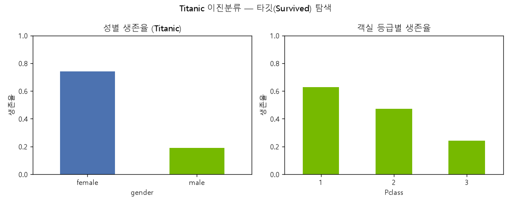
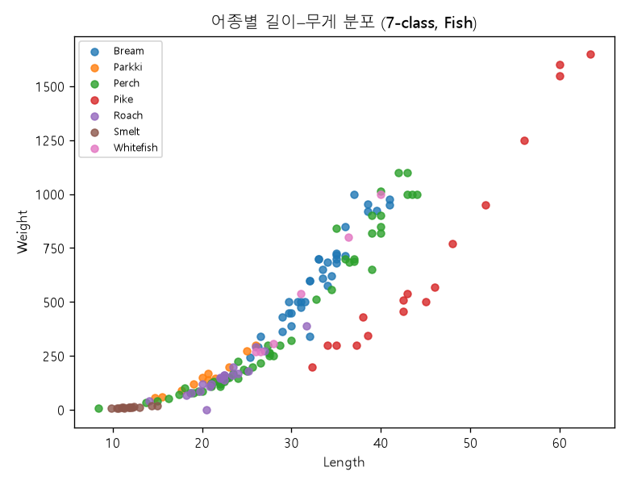

# 딥러닝 with TensorFlow·Keras

> **English summary** — A hands-on deep-learning portfolio built with TensorFlow/Keras, focused on **tabular and introductory neural networks**. It covers the full workflow: linear/polynomial regression with `Dense` networks, binary classification (Titanic), multiclass classification (Fish species, Iris), a CNN classifier for Fashion-MNIST with model persistence and inference on real images, a **batch-normalization study** comparing normalization *before vs. after* the activation function, and a convolutional **autoencoder** design on Fashion-MNIST. Every model is written from scratch with the Keras `Sequential` API, including proper standardization, one-hot encoding, callbacks (`ModelCheckpoint`, `EarlyStopping`), and save/load-based prediction pipelines.


---

## 개요

NVIDIA AI Academy Seoul 부트캠프(1기)에서 **TensorFlow·Keras 기반 딥러닝**을 학습하며 작성한 실습 코드 모음입니다. 정형 데이터(회귀·이진·다중분류)부터 이미지 기반 CNN·오토인코더까지, 딥러닝 모델을 **직접 설계 → 학습 → 저장 → 예측(추론)** 하는 전 과정을 다룹니다.

특징:

- 모든 모델은 Keras `Sequential` API로 **레이어를 직접 쌓아** 설계 (Dense / Conv2D / MaxPooling2D / Dropout / BatchNormalization / UpSampling2D)
- `StandardScaler` 정규화, `LabelEncoder`·`to_categorical` 원-핫 인코딩 등 **전처리 파이프라인** 포함
- `ModelCheckpoint`·`EarlyStopping` 콜백으로 **best 모델 저장 및 과대적합 방지**
- 학습한 모델을 `.keras`로 저장하고, `load_model`로 불러와 **새 데이터를 예측**하는 실전형 구조 (Fish, Titanic, Fashion-MNIST)
- **배치 정규화의 위치(활성화 전/후) 비교 실험**과 **컨볼루션 오토인코더** 설계로 심화 주제까지 확장

> 활성화 함수는 예제 성격에 따라 `linear`, `sigmoid`, `leaky_relu`, `relu`, `softmax` 를 목적에 맞게 선택해 사용했습니다.

---

## 모델 & 실험

| 과제 | 데이터셋 | 모델 (핵심 레이어/구조) | 대표 파일 |
|---|---|---|---|
| 선형회귀 (딥러닝) | 합성 데이터 `y = x + noise` | `Dense(1, activation='linear')` 단일 뉴런, MSE 손실 | [딥러닝_선형회귀_예제.py](src/20260610/딥러닝_선형회귀_예제.py) |
| 다항 회귀 | 캐글 Fish Market (농어 길이·무게) | `Dense(4)→Dense(8)→Dense(1)` (leaky_relu), 제곱 특성 추가, MSE | [딥러닝_선형회귀_예제2.py](src/20260610/딥러닝_선형회귀_예제2.py) |
| 모델 설계 기초 | — | `Dense(1, input_dim=3, activation='sigmoid')` + `summary()` | [딥러닝모델_설계_예제1.py](src/20260610/딥러닝모델_설계_예제1.py) |
| 이진분류 — 생존 예측 | Titanic | `Dense(8)→Dense(4)→Dense(1, sigmoid)`, StandardScaler, `binary_crossentropy` | [딥러닝_타이타닉_이진분류.py](src/20260611/딥러닝_타이타닉_이진분류.py) |
| 이진분류 — 예측/추론 | Titanic | 저장된 `titanic_bestmodel.keras` 로드 후 신규 데이터 예측 | [딥러닝_타이타닉_이진분류_예측.py](src/20260611/딥러닝_타이타닉_이진분류_예측.py) |
| 다중분류 — 어종 분류 | 캐글 Fish (7종) | `Dense(10)→Dense(7, softmax)`, LabelEncoder+to_categorical, `categorical_crossentropy`, 콜백 | [딥러닝_fish_data_다중분류.py](src/20260611/딥러닝_fish_data_다중분류.py) |
| 다중분류 — 예측/추론 | 캐글 Fish (7종) | 저장 모델+스케일러(`joblib`) 로드 후 `argmax`로 어종 분류 | [딥러닝_fish_예측.py](src/20260611/딥러닝_fish_예측.py) |
| 다중분류 — 붓꽃 | Iris (sklearn) | 데이터 로드·탐색 (전처리 시작 단계) | [딥러닝_iris_붓꽃_다중분류.py](src/20260611/딥러닝_iris_붓꽃_다중분류.py) |
| 이미지 분류 (CNN) | Fashion-MNIST (28×28, 10클래스) | `Conv2D(32)→Pool→Conv2D(64)→Pool→Flatten→Dense(100)→Dropout→Dense(40)→Dense(10, softmax)`, 콜백 | [fashin_mnist_딥러닝_분류.py](src/20260612/fashin_mnist_딥러닝_분류.py) |
| 이미지 예측/추론 | Fashion-MNIST | 저장 모델 로드 후 test 이미지 5장 예측 → 한글 클래스명 출력 | [fashion_minst_딥러닝_예측.py](src/20260612/fashion_minst_딥러닝_예측.py) |
| 실이미지 예측 | 외부 JPG (샌들) | OpenCV 리사이즈·색반전·정규화 후 저장 모델로 예측 | [fashion_mnist_임의데이터예측.py](src/20260612/fashion_mnist_임의데이터예측.py) |
| **배치정규화 — 활성화 이후** | MNIST | `Flatten→BN→Dense(8, relu)→BN→Dense(10, softmax)` (활성화 내장) | [1.활성화함수이후 배치정규화.py](src/배치정규화/1.활성화함수이후%20배치정규화.py) |
| **배치정규화 — 활성화 이전** | MNIST | `Flatten→BN→Dense(8)→BN→Activation('relu')→Dense(10)` (BN을 활성화 앞에 분리 배치) | [2.활성화함수_이전_배치정규화.py](src/배치정규화/2.활성화함수_이전_배치정규화.py) |
| **배치정규화 — CNN** | MNIST | `Conv2D(32)→BN→Activation→Pool→Conv2D(64)→Pool→Dropout→Flatten→Dense(128)→Dropout→Dense(10)` | [3.CNN_배치정규화.py](src/배치정규화/3.CNN_배치정규화.py) |
| **오토인코더 (설계)** | Fashion-MNIST | `Conv2D`·`MaxPooling2D`·`UpSampling2D` 기반 인코더-디코더 구조 설계 (데이터 준비 단계) | [패션Mnist_오토인코더모델설계.py](src/20260619/패션Mnist_오토인코더모델설계.py) |

> 참고: 일부 파일(Iris, 오토인코더)은 데이터 로드·전처리 단계까지 작성된 진행형 코드이며, 학습 스크립트는 위 표의 완성 예제를 기준으로 구성되어 있습니다.

---

## 결과

### 데이터 탐색 (신경망이 학습하는 실제 데이터)

MLP 분류 모델이 사용하는 Titanic(이진)·Fish(다중) 데이터를 시각화한 실제 결과입니다. (`results/`)

| Titanic 이진분류 — 타깃 탐색 | Fish 7-class 다중분류 |
|:---:|:---:|
|  |  |

성별·객실등급에 따른 생존율 차이가 뚜렷해 이진분류의 학습 가능성을 보여주고, 어종별 길이–무게 분포는 다중분류가 선형·비선형 경계로 구분할 여지가 있음을 시사합니다.

### 모델 학습 산출물

- **회귀** — 학습 후 `evaluate`로 MSE/MAE를 출력하고, 예측 회귀선을 matplotlib으로 시각화(주석 기반)합니다.
- **이진·다중분류** — `evaluate`로 test 정확도를 출력하고, best 모델을 `.keras`로 저장합니다. Fish/Titanic은 저장된 모델을 다시 불러와 **신규 입력에 대한 클래스(어종·생존 여부)를 예측**합니다.
- **Fashion-MNIST CNN** — `EarlyStopping`으로 val_loss 기준 조기 종료하며 best 모델을 저장하고, test 이미지와 **외부 실사진(샌들)** 모두에 대해 예측 결과를 `['티셔츠','바지',...,'앵클부츠']` 한글 클래스명으로 출력합니다.
- **배치정규화 실험** — 동일한 MNIST 분류 구조에서 BN을 **활성화 전 / 후**에 배치했을 때의 `summary()` 및 학습 거동을 비교할 수 있도록 세 가지 변형을 나란히 제공합니다.
- **오토인코더** — Conv/Pooling/UpSampling으로 입력 이미지를 압축·복원하는 인코더-디코더 뼈대를 설계합니다.

> 학습 곡선·예측 산출물 이미지는 `results/` 폴더에 저장하도록 구성되어 있습니다(예: `catdog_model.jpeg` 형태의 `savefig` 패턴). 실제 수치는 실행 환경에 따라 달라지므로 본 README에는 별도 기재하지 않습니다.

---

## 실행 방법

```bash
# 1) 의존성 설치
pip install -r requirements.txt

# 2) 예: 타이타닉 이진분류 학습 → best 모델 저장
python src/20260611/딥러닝_타이타닉_이진분류.py

# 3) 저장된 모델로 예측/추론
python src/20260611/딥러닝_타이타닉_이진분류_예측.py

# 4) Fashion-MNIST CNN 학습
python src/20260612/fashin_mnist_딥러닝_분류.py
```

> CSV·이미지 등 일부 데이터 경로는 학습 당시 환경(`/home/sckit/...`) 절대경로로 작성되어 있습니다. 실행 시 본인 환경에 맞게 데이터 경로를 수정하세요. `fashion_mnist`·`mnist`·`load_digits`·`load_iris` 등은 라이브러리에서 자동 다운로드/로드됩니다.

---

## 배운 점

- **문제 유형별 출력층·손실함수 매핑**: 회귀→`linear`+MSE, 이진→`sigmoid`+`binary_crossentropy`, 다중→`softmax`+`categorical`/`sparse_categorical_crossentropy` 를 몸으로 익혔습니다.
- **전처리의 중요성**: `StandardScaler`는 train에서 `fit_transform`, test에서는 `transform`만 적용해야 데이터 누수가 없다는 점, 그리고 `LabelEncoder`+`to_categorical` 조합으로 문자열 라벨을 원-핫으로 변환하는 흐름을 정리했습니다.
- **콜백 활용**: `ModelCheckpoint(save_best_only=True)` + `EarlyStopping(restore_best_weights=True)` 로 과대적합을 억제하고 최적 가중치를 확보하는 실전 패턴을 습득했습니다.
- **모델 영속화·추론 분리**: 학습 스크립트와 예측 스크립트를 분리하고, 모델(`.keras`)과 스케일러(`.pkl`)를 함께 저장해 **재현 가능한 추론 파이프라인**을 구성했습니다.
- **배치 정규화의 위치**가 학습 안정성에 미치는 영향을, 활성화 전/후 두 배치로 직접 비교하며 이해했습니다.

---

## 참고

- 자매 저장소 — [**computer-vision**](https://github.com/NvidiaSeoul/computer-vision) : CNN 기반 컴퓨터 비전(개·고양이 분류, 데이터 증강, 손글씨 숫자 분류)
- 자매 저장소 — [**machine-learning-sklearn**](https://github.com/NvidiaSeoul/machine-learning-sklearn) : scikit-learn 기반 고전 머신러닝
- [NVIDIA AI Academy Seoul (NvidiaSeoul)](https://github.com/NvidiaSeoul)

---

> NVIDIA AI Academy Seoul · Cohort 1 포트폴리오의 일부 — [전체 보기](https://github.com/NvidiaSeoul)
